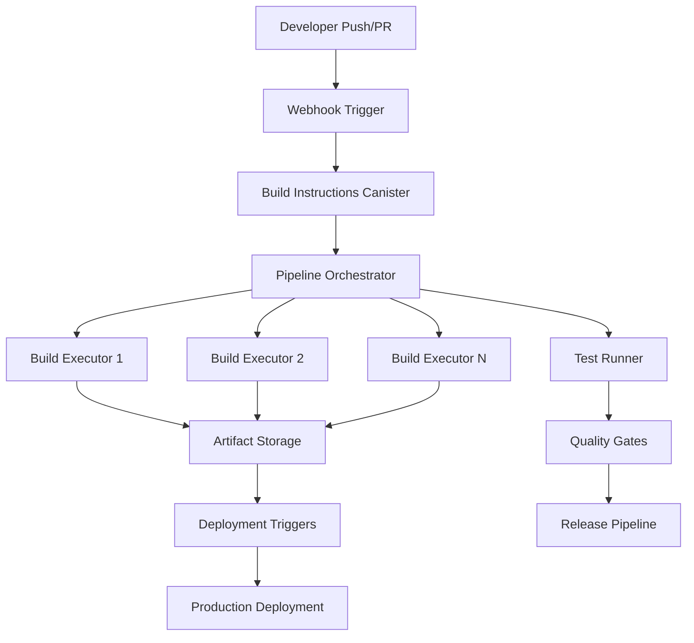
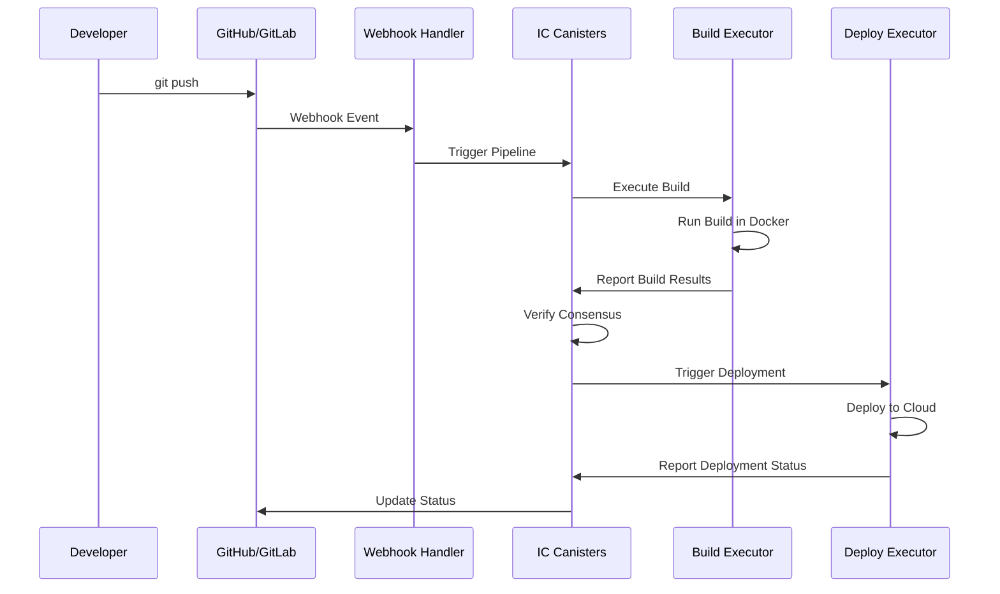

# DCanary - Decentralized CI/CD Pipeline

## 🚀 What is DCanary?

DCanary is the **world's first fully decentralized CI/CD pipeline** built on the Internet Computer Protocol (ICP). It provides complete continuous integration and deployment capabilities without relying on centralized providers like GitHub Actions, Jenkins, GitLab CI, or CircleCI.

## 🏗️ Complete CI/CD Pipeline Architecture



## 🔄 Full CI/CD Capabilities

### **Continuous Integration (CI)**
- **✅ Automated Builds**: Triggered by code commits, PRs, or schedules
- **✅ Multi-Environment**: Build across different executor environments
- **✅ Testing Integration**: Run unit tests, integration tests, e2e tests
- **✅ Code Quality**: Linting, security scanning, dependency auditing
- **✅ Artifact Generation**: Build packages, containers, binaries
- **✅ Parallel Execution**: Multiple builds running simultaneously

### **Continuous Deployment (CD)**
- **✅ Deployment Pipelines**: Automated deployment to staging/production
- **✅ Environment Promotion**: Controlled progression through environments
- **✅ Rollback Capabilities**: Automatic rollback on deployment failures
- **✅ Blue/Green Deployments**: Zero-downtime deployment strategies
- **✅ Canary Releases**: Gradual rollout with monitoring
- **✅ Infrastructure as Code**: Automated infrastructure provisioning

### **Pipeline Features**
- **✅ Workflow Orchestration**: Complex multi-stage pipelines
- **✅ Conditional Logic**: Branch-based pipeline variations
- **✅ Manual Approvals**: Human gates for critical deployments
- **✅ Pipeline Templates**: Reusable pipeline configurations
- **✅ Secret Management**: Secure handling of credentials and tokens
- **✅ Monitoring & Alerts**: Real-time pipeline status and notifications

## 🌟 Why Decentralized CI/CD?

### **🔒 Eliminating Single Points of Failure**
Traditional CI/CD relies on centralized providers that can:
- Experience outages (affecting all customers)
- Change pricing or terms of service
- Be subject to censorship or access restrictions
- Have security breaches affecting all users

### **🛡️ Enhanced Security & Trust**
- **Tamper-proof execution**: All pipeline runs recorded on blockchain
- **Consensus-based verification**: Multiple executors ensure reproducible builds
- **Cryptographic proof**: Every artifact has verifiable integrity
- **No vendor lock-in**: Your pipelines run on decentralized infrastructure

### **🌍 True Infrastructure Independence**
- **No cloud provider dependency**: Runs on Internet Computer infrastructure
- **Global distribution**: Executors located worldwide for reliability
- **Censorship resistance**: Cannot be shut down by any single entity
- **Cost predictability**: No surprise billing or usage limits

## 🛠️ Pipeline Components

### **1. Build Instructions Canister**
- Stores pipeline definitions and build scripts
- Version control for pipeline configurations
- Security validation of build instructions
- Access control and audit logging

### **2. Build Executor Canisters**
- Execute pipeline stages in isolated environments
- Support for multiple programming languages and frameworks
- Sandbox security for safe code execution
- Parallel execution across distributed nodes

### **3. Pipeline Orchestrator (Verification Canister)**
- Coordinates multi-stage pipeline execution
- Manages dependencies between pipeline stages
- Implements consensus mechanisms for build verification
- Handles pipeline timing and timeouts

### **4. Webhook Integration Canister**
- Connects to GitHub, GitLab, Bitbucket, and other SCM providers
- Triggers pipelines on code changes, PRs, releases
- Manages repository subscriptions and event filtering
- Provides status updates back to SCM providers

### **5. Artifact Storage & Distribution**
- Decentralized storage for build artifacts
- Version management and artifact retention
- Secure distribution to deployment targets
- Integration with container registries and package managers

## 🚀 Complete Pipeline Workflow

### **1. Pipeline Definition**
```yaml
# .dcanary/pipeline.yml
name: Full CI/CD Pipeline
on:
  push: [main, develop]
  pull_request: [main]

stages:
  build:
    executor: nodejs-18
    steps:
      - checkout: latest
      - run: npm ci
      - run: npm run build
      - run: npm test
      - artifact: dist/

  security:
    depends_on: [build]
    executor: security-scanner
    steps:
      - download_artifact: dist/
      - run: npm audit
      - run: snyk test
      - run: semgrep --config=auto

  deploy_staging:
    depends_on: [build, security]
    environment: staging
    steps:
      - download_artifact: dist/
      - run: kubectl apply -f k8s/staging/
      - run: kubectl rollout status deployment/app

  integration_tests:
    depends_on: [deploy_staging]
    executor: test-runner
    steps:
      - run: npm run test:e2e --env=staging

  deploy_production:
    depends_on: [integration_tests]
    environment: production
    manual_approval: true
    steps:
      - download_artifact: dist/
      - run: kubectl apply -f k8s/production/
      - run: kubectl rollout status deployment/app
```

### **2. Automated Execution**
```bash
# Triggered automatically on git push
git push origin main

# Or manually via CLI
mody pipeline run --project my-app --ref main

# Or via API
curl -X POST https://api.dcanary.io/v1/pipelines/run \
  -H "Authorization: Bearer $DCANARY_TOKEN" \
  -d '{"project": "my-app", "ref": "main"}'
```

### **3. Pipeline Monitoring**
```bash
# Real-time pipeline status
mody pipeline status --project my-app --run-id abc123

# Pipeline logs
mody pipeline logs --project my-app --run-id abc123 --stage build

# Pipeline history
mody pipeline history --project my-app --limit 10
```

## 🎯 Use Cases

### **Enterprise CI/CD**
- Replace Jenkins, TeamCity, or Bamboo
- Eliminate infrastructure maintenance overhead
- Ensure compliance and audit requirements
- Multi-region deployment capabilities

### **Open Source Projects**
- Free, unlimited pipeline minutes
- Transparent build processes
- Community-verifiable releases
- Censorship-resistant infrastructure

### **Crypto/DeFi Projects**
- Trustless smart contract deployment
- On-chain build verification
- Decentralized release processes
- Community governance integration

### **Security-Critical Applications**
- Tamper-proof build environments
- Consensus-based verification
- Cryptographic audit trails
- Air-gapped deployment options

## 🌈 Migration Strategy

### **Phase 1: Hybrid Approach**
- Keep existing CI/CD for development
- Use DCanary for production releases
- Gradual migration of critical pipelines

### **Phase 2: Feature Parity**
- Migrate complex workflows
- Integrate with existing tools
- Train teams on decentralized workflows

### **Phase 3: Full Migration**
- Complete transition to DCanary
- Sunset legacy CI/CD infrastructure
- Realize full benefits of decentralization

## 🚀 Getting Started

```bash
# Install DCanary CLI
npm install -g dcanary

# Initialize your project
dcanary init

# Deploy your first pipeline
dcanary deploy --project my-app

# Start building the future of CI/CD!
```

## 🔧 **Realistic Implementation Strategy**

### **Current IC Limitations & Solutions**

#### **🚫 What We Can't Do Directly in Canisters:**
- **Real Build Execution**: `child_process` not available in IC
- **HTTP Webhooks**: Limited HTTP outcall capabilities  
- **Direct Deployments**: No direct cloud provider access
- **File System Access**: Sandbox restrictions for real builds

#### **✅ What We Can Do with Hybrid Architecture:**

### **Phase 1: Webhook Triggers (External + IC)**
```typescript
// External webhook handler (webhook-handler/index.ts)
app.post('/webhook/github', async (req, res) => {
  const payload = req.body;
  
  // Validate webhook signature
  if (!validateSignature(payload, req.headers['x-hub-signature'])) {
    return res.status(401).json({ error: 'Invalid signature' });
  }
  
  // Extract trigger information
  const triggerData = {
    repository: payload.repository.full_name,
    ref: payload.ref,
    commit: payload.after,
    branch: payload.ref.replace('refs/heads/', ''),
    eventType: req.headers['x-github-event']
  };
  
  // Call IC canister to trigger pipeline
  try {
    const result = await webhookCanister.process_scm_event({
      provider: { GitHub: null },
      event_type: triggerData.eventType,
      repository: triggerData.repository,
      ref: triggerData.ref,
      commit_hash: triggerData.commit
    });
    
    res.json({ success: true, result });
  } catch (error) {
    res.status(500).json({ error: error.message });
  }
});
```

### **Phase 2: Build Execution (External Workers + IC Orchestration)**
```typescript
// External build executor
class ExternalBuildExecutor {
  async executeBuild(projectId: string, version: string, instructions: string) {
    // Real build execution in containerized environment
    const buildResult = await this.runInDocker({
      image: 'node:18',
      commands: instructions.split('\n'),
      timeout: 900000 // 15 minutes
    });
    
    // Report back to IC canister
    await buildExecutorCanister.report_build_result(projectId, version, {
      success: buildResult.success,
      hash: buildResult.artifactHash,
      logs: buildResult.output,
      duration: buildResult.duration
    });
  }
  
  private async runInDocker(config: BuildConfig) {
    // Docker container execution
    // Generate artifact hash
    // Handle timeouts and cleanup
  }
}
```

### **Phase 3: Deployment Pipeline (External + IC)**
```typescript
// Deployment worker
class DeploymentExecutor {
  async deployToEnvironment(artifact: Artifact, environment: string) {
    switch (environment) {
      case 'staging':
        return await this.deployToKubernetes(artifact, 'staging-namespace');
      case 'production':
        return await this.deployToKubernetes(artifact, 'production-namespace');
      case 'aws':
        return await this.deployToAWS(artifact);
      case 'vercel':
        return await this.deployToVercel(artifact);
    }
  }
  
  async deployToKubernetes(artifact: Artifact, namespace: string) {
    // kubectl apply configurations
    // Update deployment with new image
    // Wait for rollout completion
    // Report status back to IC
  }
}
```

### **Phase 4: Complete Automation Flow**


### **Infrastructure Components**

#### **1. Webhook Handler Deployment**
```yaml
# docker-compose.yml
version: '3.8'
services:
  webhook-handler:
    build: ./webhook-handler
    ports:
      - "3000:3000"
    environment:
      - WEBHOOK_CANISTER_ID=${WEBHOOK_CANISTER_ID}
      - IC_HOST=https://ic0.app
      - GITHUB_WEBHOOK_SECRET=${GITHUB_SECRET}
    restart: unless-stopped
```

#### **2. Build Executor Infrastructure**
```yaml
# build-executor.yml
apiVersion: apps/v1
kind: Deployment
metadata:
  name: build-executor
spec:
  replicas: 3
  template:
    spec:
      containers:
      - name: executor
        image: dcanary/build-executor:latest
        env:
        - name: BUILD_EXECUTOR_CANISTER_ID
          value: "${BUILD_EXECUTOR_CANISTER_ID}"
        - name: IC_NETWORK
          value: "https://ic0.app"
        resources:
          limits:
            cpu: "2"
            memory: "4Gi"
          requests:
            cpu: "1"
            memory: "2Gi"
```

#### **3. Deployment Workers**
```bash
#!/bin/bash
# deploy-worker.sh

# Register deployment worker with IC
dfx canister call verification_canister register_deployment_worker \
  "(principal \"$WORKER_PRINCIPAL\", \"$WORKER_ENDPOINT\")"

# Start worker service
node deployment-worker.js \
  --canister-id $VERIFICATION_CANISTER_ID \
  --worker-id $WORKER_ID \
  --environments "staging,production"
```

### **Benefits of Hybrid Approach**

1. **✅ Real CI/CD Functionality**: Actual builds and deployments
2. **✅ IC Orchestration**: Tamper-proof coordination and consensus
3. **✅ Scalability**: Add more external workers as needed
4. **✅ Flexibility**: Support any build environment or deployment target
5. **✅ Cost Effective**: Only pay IC cycles for coordination, not compute
6. **✅ Migration Path**: Gradually move from centralized to decentralized

### **Alternative: Pure IC Implementation (Future)**

When IC gains more capabilities:
```typescript
// Future IC HTTP outcalls
const deploymentResult = await ic.httpOutcall({
  url: 'https://api.vercel.com/v1/deployments',
  method: 'POST',
  headers: { 'Authorization': `Bearer ${token}` },
  body: JSON.stringify(deploymentConfig)
});

// Future IC compute capabilities
const buildResult = await ic.executeInSandbox({
  commands: buildInstructions,
  timeout: 900,
  resources: { cpu: '2vcpu', memory: '4GB' }
});
```

---

**DCanary: Building the future of CI/CD, one decentralized pipeline at a time.** 🚀
