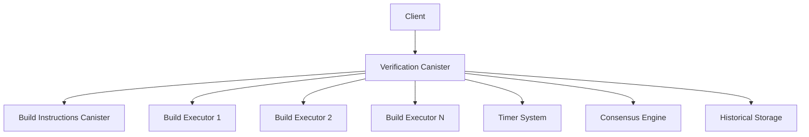

# Verification Canister

The Verification Canister is a critical component of the DCanary build verification system that orchestrates the build verification process across multiple executor canisters to achieve consensus on build reproducibility.

## Overview

The verification canister acts as the central coordinator that:
- Retrieves build instructions from the build instructions canister
- Triggers parallel builds on multiple executor canisters
- Monitors build progress and collects results
- Applies consensus logic to determine final verification status
- Provides APIs for requesting verification and checking status

## Architecture



## Key Features

### 🔄 Asynchronous Orchestration
- Parallel execution across multiple build executors
- Timer-based polling for build status monitoring
- Non-blocking operation with immediate response

### 🎯 Consensus Mechanism
- Configurable consensus threshold (default 51%)
- Hash-based verification matching
- Detailed result tracking per executor

### 🔐 Access Control
- Designated principal authorization for verification requests
- Admin-only configuration management
- Secure inter-canister communication

### ⏱️ Timeout Management
- Configurable verification timeouts (default 15 minutes)
- Automatic cleanup of timed-out verifications
- Graceful handling of partial failures

### 📊 Monitoring & History
- Complete verification history storage
- Active verification tracking
- Detailed executor result logging

## Data Types

### VerificationStatus
```typescript
type VerificationStatus = 
    | { Pending: null }
    | { Verified: null }
    | { Failed: null };
```

### ExecutorResult
```typescript
type ExecutorResult = {
    executor_id: Principal;
    hash: string | null;
    error: string | null;
    completed: boolean;
    execution_time: bigint | null;
};
```

### VerificationResult
```typescript
type VerificationResult = {
    status: VerificationStatus;
    verified_hash: string | null;
    error: string | null;
    executor_results: ExecutorResult[];
    consensus_threshold: number;
    total_executors: number;
    matching_results: number;
    created_at: bigint;
    completed_at: bigint | null;
};
```

## API Reference

### Core Functions

#### `request_verification`
```typescript
@update([IDL.Text, IDL.Text, IDL.Opt(IDL.Nat64)], VerificationResultWrapper)
async request_verification(
    project_id: string, 
    version: string, 
    timeout_seconds?: bigint
): Promise<VerificationResultWrapper>
```

Initiates a new verification process for a project version.

**Parameters:**
- `project_id`: Unique identifier for the project
- `version`: Version string (semantic versioning recommended)
- `timeout_seconds`: Optional timeout in seconds (default: 900)

**Returns:** Initial verification result with `Pending` status

**Access:** Authorized requester only

#### `get_verification_status`
```typescript
@query([IDL.Text, IDL.Text], VerificationResultWrapper)
get_verification_status(
    project_id: string, 
    version: string
): VerificationResultWrapper
```

Retrieves the current status of a verification process.

**Parameters:**
- `project_id`: Project identifier
- `version`: Version string

**Returns:** Current verification result or error if not found

**Access:** Public query

### Configuration Management

#### `update_authorized_requester`
```typescript
@update([IDL.Principal], IDL.Bool)
update_authorized_requester(new_requester: Principal): boolean
```

Updates the principal authorized to request verifications.

**Access:** Admin only

#### `update_build_executor_canisters`
```typescript
@update([IDL.Vec(IDL.Principal)], IDL.Bool)
update_build_executor_canisters(executor_ids: Principal[]): boolean
```

Updates the list of build executor canister IDs.

**Access:** Admin only

#### `update_build_instructions_canister`
```typescript
@update([IDL.Principal], IDL.Bool)
update_build_instructions_canister(canister_id: Principal): boolean
```

Updates the build instructions canister ID.

**Access:** Admin only

### Monitoring Functions

#### `get_canister_info`
```typescript
@query([], CanisterInfo)
get_canister_info(): CanisterInfo
```

Returns comprehensive canister configuration and statistics.

#### `list_verification_history`
```typescript
@query([IDL.Opt(IDL.Nat64), IDL.Opt(IDL.Nat64)], IDL.Vec(IDL.Tuple(IDL.Text, VerificationResult)))
list_verification_history(limit?: bigint, offset?: bigint): [string, VerificationResult][]
```

Lists historical verification results with pagination.

#### `get_active_verifications`
```typescript
@query([], IDL.Vec(IDL.Tuple(IDL.Text, VerificationResult)))
get_active_verifications(): [string, VerificationResult][]
```

Returns currently active verification processes.

## Verification Process Flow

1. **Initiation**
   - Client calls `request_verification` with project details
   - Canister validates authorization and input
   - Retrieves build instructions from instructions canister

2. **Execution**
   - Triggers parallel builds on all configured executor canisters
   - Starts timer-based monitoring for result collection
   - Updates verification state as results arrive

3. **Consensus**
   - Collects results from all executors (or timeout)
   - Counts matching hashes for consensus calculation
   - Applies threshold logic to determine final status

4. **Completion**
   - Moves result to historical storage
   - Cleans up active state and timers
   - Makes final result available via status queries

## Configuration

### Default Settings
```typescript
DEFAULT_TIMEOUT_SECONDS = 900n;        // 15 minutes
MIN_CONSENSUS_PERCENTAGE = 51;         // 51% consensus required
POLLING_INTERVAL_SECONDS = 30;         // 30 seconds between polls
```

### Required Configuration
- **Build Instructions Canister ID**: Must be set during deployment
- **Build Executor Canister IDs**: List of executor canisters
- **Authorized Requester**: Principal allowed to request verifications
- **Admin Principal**: Principal for configuration management

## Deployment

### Prerequisites
1. Deploy build instructions canister
2. Deploy one or more build executor canisters
3. Configure dfx with appropriate principal identities

### Deployment Steps

1. **Build and Deploy**
   ```bash
   # Deploy verification canister
   dfx deploy verification_canister --with-cycles 2000000000000
   
   # Or use the provided deployment script
   ./deploy_verification.sh local
   ```

2. **Configuration**
   ```bash
   # Set build instructions canister
   dfx canister call verification_canister update_build_instructions_canister "(principal \"$INSTRUCTIONS_CANISTER_ID\")"
   
   # Set build executor canisters
   dfx canister call verification_canister update_build_executor_canisters "(vec { principal \"$EXECUTOR1_ID\"; principal \"$EXECUTOR2_ID\" })"
   
   # Set authorized requester
   dfx canister call verification_canister update_authorized_requester "(principal \"$REQUESTER_PRINCIPAL\")"
   ```

3. **Verification**
   ```bash
   # Check configuration
   dfx canister call verification_canister get_canister_info
   ```

## Usage Examples

### Request Verification
```bash
# Request verification for a project
dfx canister call verification_canister request_verification '("my-project", "1.0.0", opt 600)'
```

### Check Status
```bash
# Check verification status
dfx canister call verification_canister get_verification_status '("my-project", "1.0.0")'
```

### Monitor Active Verifications
```bash
# List active verifications
dfx canister call verification_canister get_active_verifications
```

### View History
```bash
# List recent verification history
dfx canister call verification_canister list_verification_history '(opt 10, opt 0)'
```

## Error Handling

### Common Errors

| Error Type | Description | Resolution |
|------------|-------------|------------|
| `Unauthorized` | Caller not authorized to request verification | Use authorized principal |
| `InvalidInput` | Missing or invalid project ID/version | Provide valid input |
| `InstructionsNotFound` | Build instructions not available | Ensure instructions are stored first |
| `TimeoutError` | Verification exceeded timeout limit | Check executor availability |
| `ConsensusFailure` | Insufficient executor agreement | Review executor configuration |

### Error Recovery
- Failed verifications can be retried after addressing the underlying issue
- Timed-out verifications are automatically cleaned up
- Partial failures provide detailed executor-specific error information

## Monitoring and Maintenance

### Health Checks
- Monitor active verification count
- Check executor canister availability
- Verify consensus threshold effectiveness

### Performance Optimization
- Adjust polling interval based on executor response times
- Tune timeout values for different project types
- Scale executor count for higher throughput

### Capacity Planning
- Each verification consumes cycles for inter-canister calls
- Timer operations have ongoing cycle costs
- Storage grows with verification history

## Security Considerations

### Access Control
- Only designated principals can request verifications
- Admin functions require separate authorization
- Inter-canister calls use trusted canister IDs

### Consensus Security
- Multiple executors provide redundancy against single points of failure
- Consensus threshold prevents manipulation by compromised executors
- Hash verification ensures build integrity

### Resource Protection
- Timeout limits prevent resource exhaustion
- Rate limiting through authorization controls
- Cycle management for sustainable operation

## Testing

### Unit Tests
Run the comprehensive test suite:
```bash
npm test
```

### Integration Testing
```bash
# Deploy full system locally
dfx start --clean
./deploy_verification.sh local

# Run integration tests
npm run test:integration
```

### Manual Testing
```bash
# Store test build instructions
dfx canister call build_instructions_canister store_build_instructions '("test-project", "1.0.0", "echo hello")'

# Request verification
dfx canister call verification_canister request_verification '("test-project", "1.0.0", opt 300)'

# Monitor progress
dfx canister call verification_canister get_verification_status '("test-project", "1.0.0")'
```

## Troubleshooting

### Common Issues

1. **Verification Stuck in Pending**
   - Check executor canister status
   - Verify build instructions exist
   - Monitor timer execution

2. **Consensus Failures**
   - Review executor count vs threshold
   - Check for executor-specific errors
   - Validate build instruction determinism

3. **Timeout Issues**
   - Increase timeout for complex builds
   - Check executor resource availability
   - Monitor inter-canister call latency

### Debug Commands
```bash
# Check canister configuration
dfx canister call verification_canister get_canister_info

# View active verifications
dfx canister call verification_canister get_active_verifications

# Check recent history
dfx canister call verification_canister list_verification_history '(opt 5, opt 0)'
```

## Contributing

When contributing to the verification canister:

1. Maintain backward compatibility in API changes
2. Add comprehensive tests for new features
3. Update documentation for configuration changes
4. Consider cycle consumption in optimizations
5. Preserve security invariants in modifications

## License

This project is licensed under the same terms as the parent DCanary project.
